# Баг-репорты Avito Team - оформление "таблица" (версия 5)

---

### Баг-репорт #1

| Поле                       | Описание                                                                                                                                                       |
|----------------------------|----------------------------------------------------------------------------------------------------------------------------------------------------------------|
| **Заголовок**              | Фильтр по городам не фильтрует выдачу                                                                                                                          |
| **Описание**               | При выбранном городе "Санкт-Петербург" в карточках отображаются локации "Москва", "Самара".                                                                    |
| **Шаги воспроизведения**   | 1) Открыть страницу вакансий. 2) Ввести запрос: "Аналитик". 3) Выбрать город "Санкт-Петербург" в фильтре. 4) Посмотреть локации в карточках вакансий. |
| **Фактический результат**  | В выдаче присутствуют вакансии других городов.                                                                                                                 |
| **Скриншот**               | 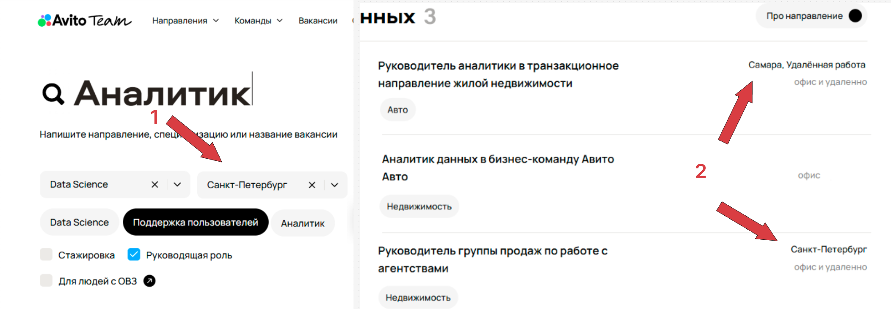                                                                                      |
| **Ожидаемое**              | В выдаче остаются только вакансии, соответствующие выбранному городу.                                                                                          |
| **Приоритет**              | High                                                                                                                                                           |
| **Почему такой приоритет** | Ломает основной сценарий поиска: выдача становится нерелевантной.                                                                                              |

---

### Баг-репорт #2

| Поле                       | Описание                                                                                                                                                                                                                                                                                                                                                                                                                      |
|----------------------------|-------------------------------------------------------------------------------------------------------------------------------------------------------------------------------------------------------------------------------------------------------------------------------------------------------------------------------------------------------------------------------------------------------------------------------|
| **Заголовок**              | Фильтр "Формат работы" не применяется                                                                                                                                                                                                                                                                                                                                                                                         |
| **Описание**               | При включенном фильтре "Можно удаленно" в карточках видны метки "офис" / "офис и удаленно".                                                                                                                                                                                                                                                                                                                                   |
| **Шаги воспроизведения**   | 1) Открыть страницу вакансий. 2) В строке поиска ввести запрос "Аналитик". 3) Применить фильтры: &nbsp;&nbsp;• Направление: Data Science &nbsp;&nbsp;• Город: Санкт-Петербург &nbsp;&nbsp;• Формат работы: Можно удаленно 4) Пролистать до секций с вакансиями "Финансы, закупки и аудит" и "Аналитика данных". 5) В правом блоке карточек проверить формат работы. 6) Просмотреть карточки вакансий. |
| **Фактический результат**  | В выдаче есть офисные варианты.                                                                                                                                                                                                                                                                                                                                                                                               |
| **Скриншот**               | 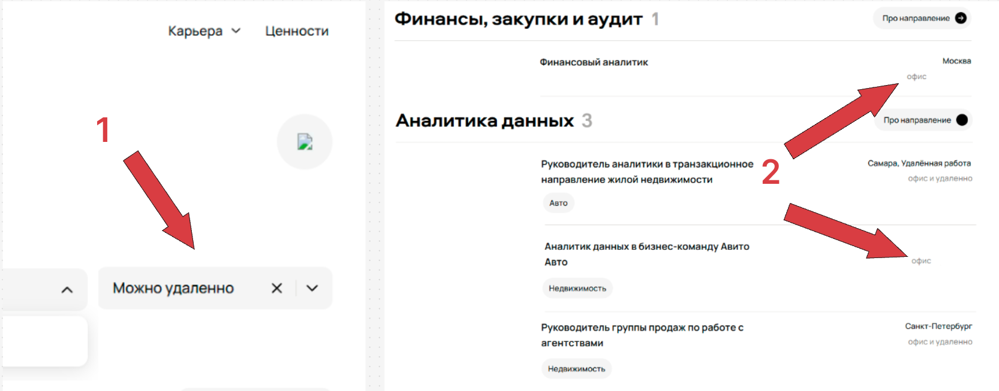                                                                                                                                                                                                                                                                                                                                                         |
| **Ожидаемое**              | В выдаче только вакансии, соответствующие выбранному формату работы.                                                                                                                                                                                                                                                                                                                                                          |
| **Приоритет**              | High                                                                                                                                                                                                                                                                                                                                                                                                                          |
| **Почему такой приоритет** | Искажает результаты поиска по одному из ключевых фильтров.                                                                                                                                                                                                                                                                                                                                                                    |

---

### Баг-репорт #3

| Поле                       | Описание                                                                                                                                                                                                                                                                                                              |
|----------------------------|-----------------------------------------------------------------------------------------------------------------------------------------------------------------------------------------------------------------------------------------------------------------------------------------------------------------------|
| **Заголовок**              | Блок "Ничего не нашлось" отображается при наличии результатов                                                                                                                                                                                                                                                         |
| **Описание**               | На странице показывается блок "Ничего не нашлось", при этом ниже продолжают отображаться вакансии.                                                                                                                                                                                                                    |
| **Шаги воспроизведения**   | 1) Открыть страницу вакансий. 2) В строке поиска ввести запрос "Аналитик". 3) Применить фильтры: &nbsp;&nbsp;• Направление: Data Science &nbsp;&nbsp;• Город: Санкт-Петербург &nbsp;&nbsp;• Формат работы: Можно удаленно 4) Пролистать до блока "Ничего не нашлось". 5) Продолжить скролл ниже. |
| **Фактический результат**  | Empty-state появляется среди результатов.                                                                                                                                                                                                                                                                             |
| **Скриншот**               | 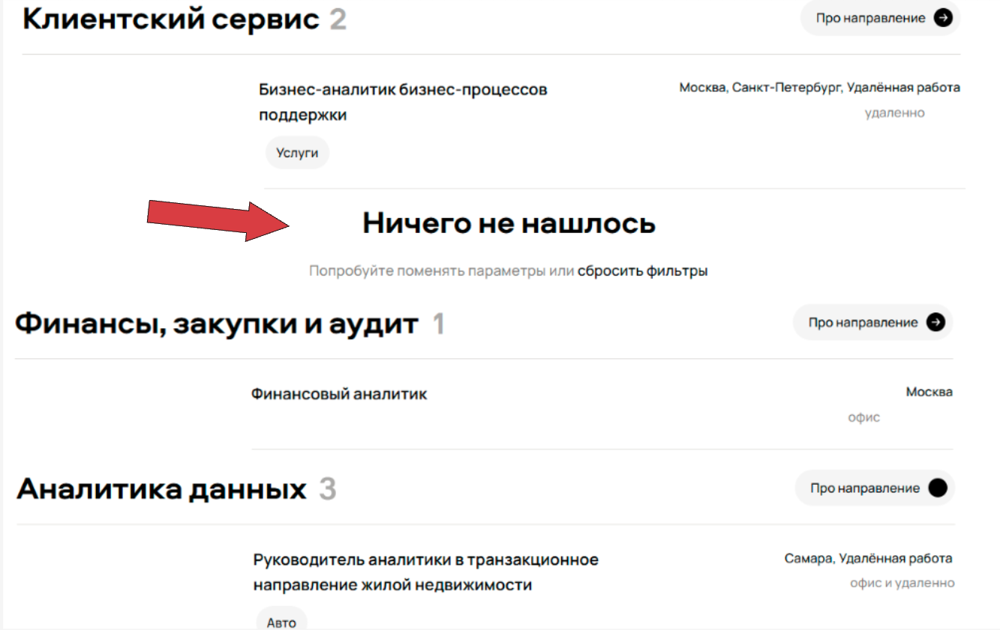                                                                                                                                                                                                                                          |
| **Ожидаемое**              | Empty-state показывается только при полном отсутствии результатов.                                                                                                                                                                                                                                                    |
| **Приоритет**              | High                                                                                                                                                                                                                                                                                                                  |
| **Почему такой приоритет** | Сильно дезинформирует: пользователь может решить, что результатов нет, и уйти.                                                                                                                                                                                                                                        |

---

### Баг-репорт #4.A

| Поле                       | Описание                                                                                                                                                                                                                                                                                                                                                                                                                                         |
|----------------------------|--------------------------------------------------------------------------------------------------------------------------------------------------------------------------------------------------------------------------------------------------------------------------------------------------------------------------------------------------------------------------------------------------------------------------------------------------|
| **Заголовок**              | Фильтр "Команда" не синхронизирован с выдачей                                                                                                                                                                                                                                                                                                                                                                                                    |
| **Описание**               | Фильтр "Команда" не синхронизирован с выдачей: в вакансиях указаны команды (например, "недвижимость", "авто"), но в фильтре они не отображаются.                                                                                                                                                                                                                                                                                                 |
| **Шаги воспроизведения**   | 1) Открыть страницу вакансий. 2) В строке поиска ввести запрос "Аналитик". 3) Применить фильтры: &nbsp;&nbsp;• Направление: Data Science &nbsp;&nbsp;• Город: Санкт-Петербург &nbsp;&nbsp;• Формат работы: Можно удаленно 4) Убедиться, что в выдаче в параметрах присутствует значение команды (например, в блоке "Аналитика данных" отображается "авто", "недвижимость"). 5) Открыть выпадающий список фильтра "Команда". |
| **Фактический результат**  | В фильтре показывается сообщение "Вакансий пока нет / Нет команд для этих вакансий", список команд не отображается.                                                                                                                                                                                                                                                                                                                              |
| **Скриншот**               |                                                                                                                                                                                                                                                                                                                                                                 |
| **Ожидаемое**              | В фильтре отображается список команд, которые реально присутствуют в выдаче.                                                                                                                                                                                                                                                                                                                                                                     |
| **Приоритет**              | Medium                                                                                                                                                                                                                                                                                                                                                                                                                                           |
| **Почему такой приоритет** | Ломает фильтрацию по одному из фильтров, однако основной пользовательский сценарий (найти вакансию) не блокируется.                                                                                                                                                                                                                                                                                                                              |

---

### Баг-репорт #4.B

| Поле                       | Описание                                                                                                                                                      |
|----------------------------|---------------------------------------------------------------------------------------------------------------------------------------------------------------|
| **Заголовок**              | Неверный текст в фильтре "Команда": отображается "Вакансий пока нет" вместо "Нет команд для этих вакансий"                                                    |
| **Описание**               | Если вакансии в выдаче есть, но ни у одной не заполнена команда, фильтр должен показывать сообщение "Нет команд для этих вакансий", а не "Вакансий пока нет". |
| **Шаги воспроизведения**   | 1) Открыть страницу вакансий. 2) Выбрать условия, при которых вакансии есть, но поле "Команда" у всех пустое. 3) Открыть фильтр "Команда".              |
| **Фактический результат**  | Фильтр показывает сообщение "Вакансий пока нет".                                                                                                              |
| **Скриншот**               |                                                                                            |
| **Ожидаемое**              | Фильтр отображает сообщение "Нет команд для этих вакансий".                                                                                                   |
| **Приоритет**              | Low                                                                                                                                                           |
| **Почему такой приоритет** | Никак не влияет на основной пользовательский сценарий, только неверный empty-state текст.                                                                     |

*PS:* Текст "Нет команд для этих вакансий" взят из прода: https://career.avito.com/vacancies/?q=Data&action=filter&managers=Y |
---

### Баг-репорт #5

| Поле                       | Описание                                                                                                                          |
|----------------------------|-----------------------------------------------------------------------------------------------------------------------------------|
| **Заголовок**              | В хедере отображается broken-image вместо иконки крестика                                                                         |
| **Описание**               | В правом верхнем углу страницы вместо корректной иконки отображается broken-image.                                                |
| **Шаги воспроизведения**   | 1) Открыть страницу вакансий Avito Team. 2) Выполнить поиск. 3) Посмотреть в правый верхний угол хедера.                    |
| **Фактический результат**  | Отображается broken-image вместо иконки.                                                                                          |
| **Скриншот**               | 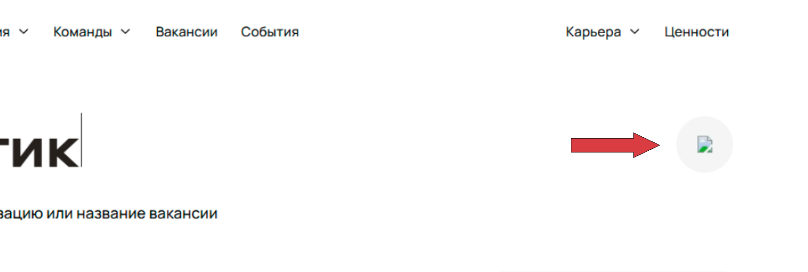                                                                  |
| **Ожидаемое**              | Корректная иконка крестика.                                                                                                       |
| **Приоритет**              | Medium / High                                                                                                                     |
| **Почему такой приоритет** | Не влияет на основной пользовательский сценарий, однако хедер - первый экран, и баги в нем могут сказаться на репутации компании. |

---

### Баг-репорт #6

| Поле                       | Описание                                                                                                                                                                                                                                                                                                                                                            |
|----------------------------|---------------------------------------------------------------------------------------------------------------------------------------------------------------------------------------------------------------------------------------------------------------------------------------------------------------------------------------------------------------------|
| **Заголовок**              | В карточке вакансии не отображается город/локация                                                                                                                                                                                                                                                                                                                   |
| **Описание**               | В карточке вакансии отсутствует описание локации (город), хотя оно предусмотрено и отображается в соседних карточках.                                                                                                                                                                                                                                               |
| **Шаги воспроизведения**   | 1) Открыть страницу вакансий. 2) В строке поиска ввести запрос "Аналитик". 3) Применить фильтры: &nbsp;&nbsp;• Направление: Data Science &nbsp;&nbsp;• Город: Санкт-Петербург &nbsp;&nbsp;• Формат работы: Можно удаленно 4) Пролистать вниз до блока "Аналитика данных". 5) Найти карточку, где вместо города пусто/не отображается значение. |
| **Фактический результат**  | Город не показан.                                                                                                                                                                                                                                                                                                                                                   |
| **Скриншот**               | 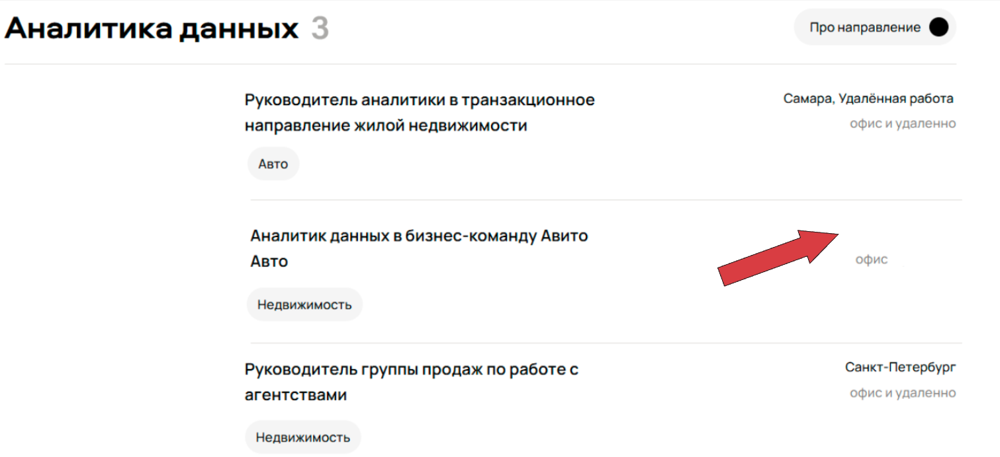                                                                                                                                                                                                                                                                                           |
| **Ожидаемое**              | Город отображается.                                                                                                                                                                                                                                                                                                                                                 |
| **Приоритет**              | Medium                                                                                                                                                                                                                                                                                                                                                              |
| **Почему такой приоритет** | Потеря ключевой информации для принятия решения пользователю. В случае работающих фильтров по городам важность этого бага падает (пользователь понимает, что в выдаче только отфильтрованные вакансии по городам).                                                                                                                                                  |

---

### Баг-репорт #7

| Поле                       | Описание                                                                                                                                                                                                                                                                                                                                                                                                  |
|----------------------------|-----------------------------------------------------------------------------------------------------------------------------------------------------------------------------------------------------------------------------------------------------------------------------------------------------------------------------------------------------------------------------------------------------------|
| **Заголовок**              | Неверная "команда/категория" в карточке вакансии                                                                                                                                                                                                                                                                                                                                                          |
| **Описание**               | В секции "Аналитика данных" в карточках вакансий отображается тег команды/категории (например, "Авто"), который не соответствует тексту вакансии (упоминается "недвижимость"/другое направление). Это вводит в заблуждение и выглядит как ошибка привязки тега к вакансии.                                                                                                                                |
| **Шаги воспроизведения**   | 1) Открыть страницу вакансий. 2) В строке поиска ввести запрос "Аналитик". 3) Применить фильтры: &nbsp;&nbsp;• Направление: Data Science &nbsp;&nbsp;• Город: Санкт-Петербург &nbsp;&nbsp;• Формат работы: Можно удаленно 4) Пролистать до секции "Аналитика данных". 5) Найти карточку "Руководитель аналитики … недвижимости" и проверить тег под названием (отображается "Авто"). |
| **Фактический результат**  | Под вакансией отображается тег "Авто", хотя по тексту вакансии указано направление "недвижимость" (тег не соответствует вакансии).                                                                                                                                                                                                                                                                        |
| **Скриншот**               | 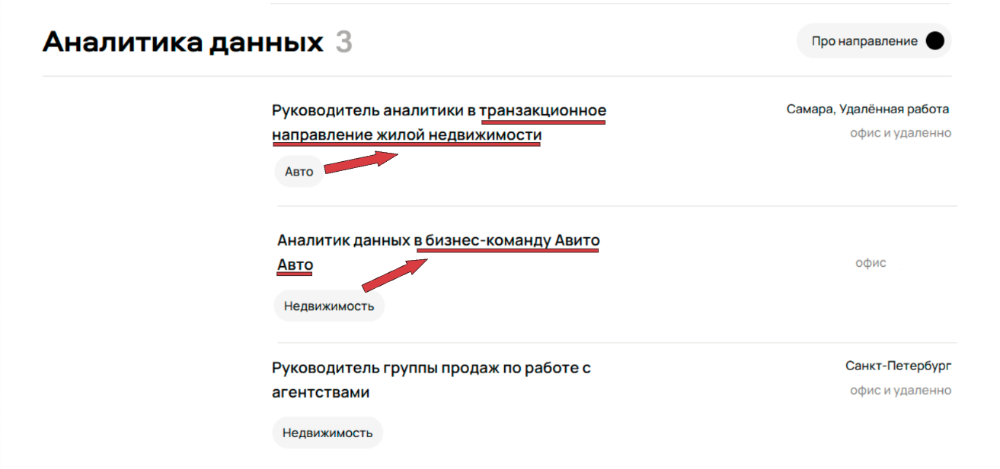                                                                                                                                                                                                                                                                                                                       |
| **Ожидаемое**              | Тег команды/категории соответствует вакансии.                                                                                                                                                                                                                                                                                                                                                             |
| **Приоритет**              | Medium                                                                                                                                                                                                                                                                                                                                                                                                    |
| **Почему такой приоритет** | Ошибка в данных/маркировке вакансии вводит пользователя в заблуждение и снижает доверие к выдаче. Не блокирует основной сценарий поиска, но влияет на корректность восприятия вакансий и фильтрации по категориям/командам.                                                                                                                                                                               |

---

### Баг-репорт #8

| Поле                       | Описание                                                                                                                                                                     |
|----------------------------|------------------------------------------------------------------------------------------------------------------------------------------------------------------------------|
| **Заголовок**              | В футере указан неверный адрес "ул. Лесная, 77" вместо "Лесная, 7"                                                                                                           |
| **Описание**               | В блоке "Офис в Москве" внизу страницы отображается неправильный номер дома (77), тогда как корректный адрес - "Лесная, 7".                                                  |
| **Шаги воспроизведения**   | 1) Открыть страницу вакансий. 2) Пролистать вниз до футера/блока с офисами. 3) Найти "Офис в Москве".                                                                  |
| **Фактический результат**  | Отображается "ул. Лесная, 77".                                                                                                                                               |
| **Скриншот**               | 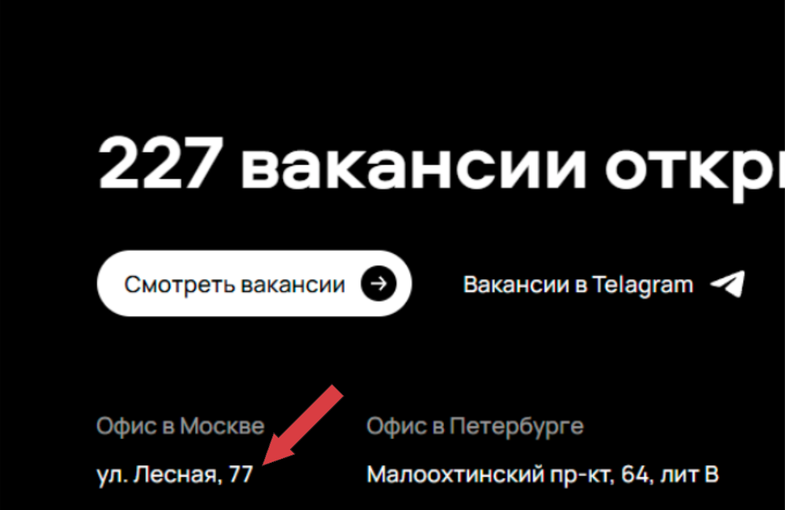                                                                                                                  |
| **Ожидаемое**              | Отображается "Лесная, 7".                                                                                                                                                    |
| **Приоритет**              | Medium                                                                                                                                                                       |
| **Почему такой приоритет** | Публикация неверной контактной информации - риск для пользовательского опыта и доверия к компании. Это не влияет на выдачу вакансий, но относится к важным публичным данным. |

**P.S.:** Адрес проверен на https://career.avito.com/vacancies/ и на Яндекс Картах 🙂 |
---

### Баг-репорт #9

| Поле                       | Описание                                                                                                                                                                                                                                                                                                                                                                                                                        |
|----------------------------|---------------------------------------------------------------------------------------------------------------------------------------------------------------------------------------------------------------------------------------------------------------------------------------------------------------------------------------------------------------------------------------------------------------------------------|
| **Заголовок**              | Счётчик вакансий в секции "Клиентский сервис" не совпадает с фактическим количеством вакансий в нем                                                                                                                                                                                                                                                                                                                             |
| **Описание**               | В заголовке секции "Клиентский сервис" указано "2", но на экране отображается 1 вакансия.                                                                                                                                                                                                                                                                                                                                       |
| **Шаги воспроизведения**   | 1) Открыть страницу вакансий. 2) В строке поиска ввести запрос "Аналитик". 3) Применить фильтры: &nbsp;&nbsp;• Направление: Data Science &nbsp;&nbsp;• Город: Санкт-Петербург &nbsp;&nbsp;• Формат работы: Можно удаленно 4) Пролистать вниз до блока "Клиентский сервис". 5) Посчитать количество карточек вакансий, отображенных внутри секции, и сравнить с числом, указанным напротив названия секции. |
| **Фактический результат**  | Карточек меньше, чем указано в счётчике.                                                                                                                                                                                                                                                                                                                                                                                        |
| **Скриншот**               | 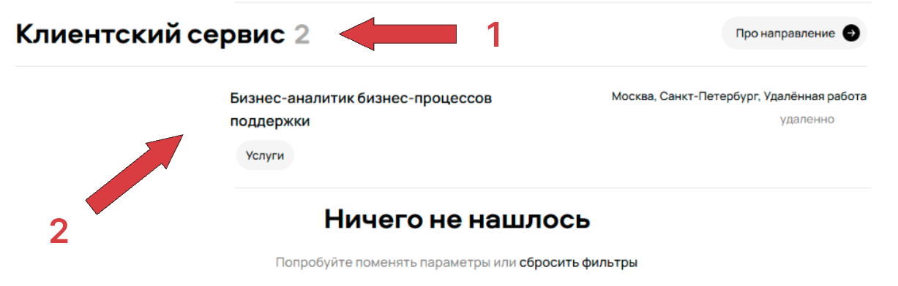                                                                                                                                                                                                                                                                                                                                          |
| **Ожидаемое**              | Счётчик соответствует количеству отображаемых карточек.                                                                                                                                                                                                                                                                                                                                                                         |
| **Приоритет**              | Low                                                                                                                                                                                                                                                                                                                                                                                                                             |
| **Почему такой приоритет** | Ошибка данных/рендера, однако пользователю не мешает.                                                                                                                                                                                                                                                                                                                                                                           |

---

### Баг-репорт #10

| Поле                       | Описание                                                                                                                                                                                                                                                                                                                                                                                                                             |
|----------------------------|--------------------------------------------------------------------------------------------------------------------------------------------------------------------------------------------------------------------------------------------------------------------------------------------------------------------------------------------------------------------------------------------------------------------------------------|
| **Заголовок**              | В кнопке "Про направление" в секции "Аналитика данных" отображается неверная иконка                                                                                                                                                                                                                                                                                                                                                  |
| **Описание**               | В секции "Аналитика данных" не подставляется корректная иконка для кнопки "Про направление": вместо стрелки отображается чёрный круг.                                                                                                                                                                                                                                                                                                |
| **Шаги воспроизведения**   | 1) Открыть страницу вакансий. 2) В строке поиска ввести запрос "Аналитик". 3) Применить фильтры: &nbsp;&nbsp;• Направление: Data Science &nbsp;&nbsp;• Город: Санкт-Петербург &nbsp;&nbsp;• Формат работы: Можно удаленно 4) Пролистать вниз до блока "Аналитика данных". 5) В правой части заголовка секции найти кнопку "Про направление". 6) Сравнить отображение иконки в кнопке между разными секциями. |
| **Фактический результат**  | Иконка отображается некорректно.                                                                                                                                                                                                                                                                                                                                                                                                     |
| **Скриншот**               | 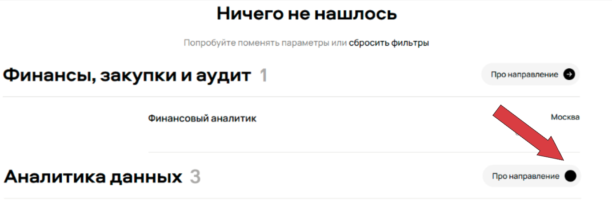                                                                                                                                                                                                                                                                                                                                                                    |
| **Ожидаемое**              | В кнопке "Про направление" отображается иконка стрелки.                                                                                                                                                                                                                                                                                                                                                                              |
| **Приоритет**              | Low                                                                                                                                                                                                                                                                                                                                                                                                                                  |
| **Почему такой приоритет** | Никак не влияет на основной пользовательский сценарий, только визуальный баг.                                                                                                                                                                                                                                                                                                                                                        |

---

### Баг-репорт #11

| Поле                       | Описание                                                                           |
|----------------------------|------------------------------------------------------------------------------------|
| **Заголовок**              | Неверное склонение в баннере "227 вакансии открыто"                                |
| **Описание**               | Внизу страницы отображается грамматически неверная форма слова "вакансия".         |
| **Шаги воспроизведения**   | 1) Открыть страницу вакансий. 2) Пролистать к нижнему баннеру.                  |
| **Фактический результат**  | Отображается "227 вакансии".                                                       |
| **Скриншот**               | 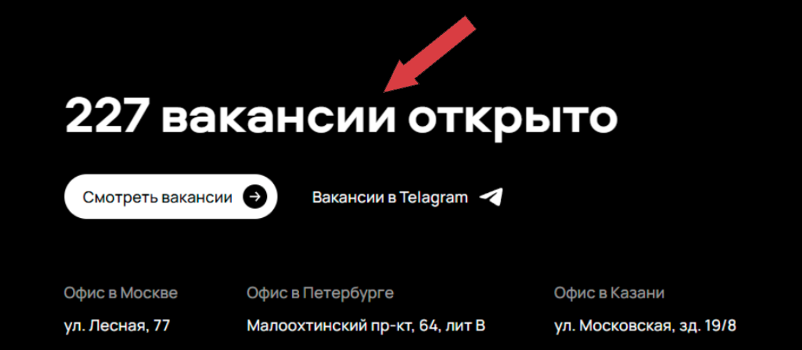                  |
| **Ожидаемое**              | Отображается "227 вакансий открыто". Теперь слово "вакансия" правильно склоняется. |
| **Приоритет**              | Low                                                                                |
| **Почему такой приоритет** | Никак не влияет на основной пользовательский сценарий, только визуальный баг.      |

---

### Баг-репорт #12

| Поле                       | Описание                                                                                                                                                                                                                                                                                                                                                                                                                                                                                                                  |
|----------------------------|---------------------------------------------------------------------------------------------------------------------------------------------------------------------------------------------------------------------------------------------------------------------------------------------------------------------------------------------------------------------------------------------------------------------------------------------------------------------------------------------------------------------------|
| **Заголовок**              | Строка "формат работы" в правом блоке карточки вакансии смещается и отображается с разным выравниванием                                                                                                                                                                                                                                                                                                                                                                                                                   |
| **Описание**               | В правом информационном блоке карточек вакансий вторая строка с форматом работы отображается неравномерно: в разных карточках она выровнена по-разному.                                                                                                                                                                                                                                                                                                                                                                   |
| **Шаги воспроизведения**   | 1) Открыть страницу вакансий. 2) В строке поиска ввести запрос "Аналитик". 3) Применить фильтры: &nbsp;&nbsp;• Направление: Data Science &nbsp;&nbsp;• Город: Санкт-Петербург &nbsp;&nbsp;• Формат работы: Можно удаленно 4) Пролистать список вакансий и найти несколько карточек подряд. 5) В каждой карточке посмотреть правый блок (где город/локация и ниже формат работы). 6) Визуально сравнить позицию второй строки - она должна начинаться на одной вертикали, но по факту это не так'. |
| **Фактический результат**  | Форматы работы визуально стоят на разных позициях.                                                                                                                                                                                                                                                                                                                                                                                                                                                                        |
| **Скриншот**               | 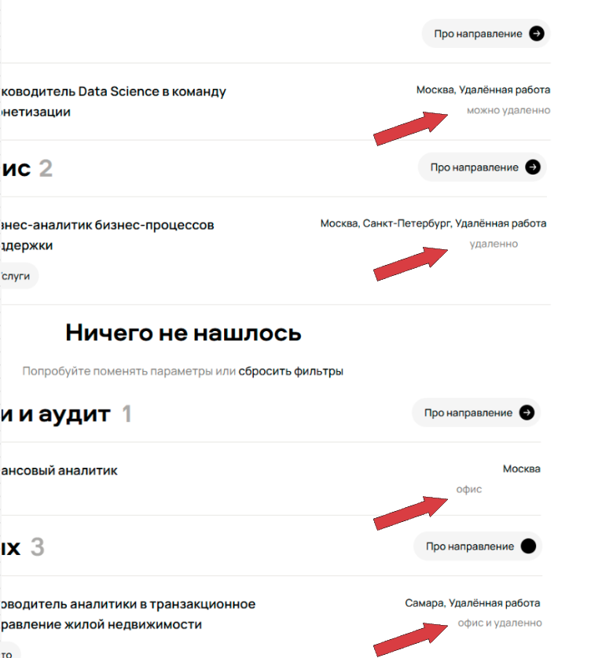                                                                                                                                                                                                                                                                                                                                                                                                                                                         |
| **Ожидаемое**              | Строка формата работы всегда выровнена одинаково.                                                                                                                                                                                                                                                                                                                                                                                                                                                                         |
| **Приоритет**              | Low                                                                                                                                                                                                                                                                                                                                                                                                                                                                                                                       |
| **Почему такой приоритет** | Ухудшает читаемость, однако функционально не блокирует.                                                                                                                                                                                                                                                                                                                                                                                                                                                                   |

---

### Баг-репорт #13

| Поле                       | Описание                                                                                  |
|----------------------------|-------------------------------------------------------------------------------------------|
| **Заголовок**              | Опечатка в тексте ссылки: "Вакансии в Telagram" вместо "Вакансии в Telegram"              |
| **Описание**               | В футере страницы в блоке с ссылками на вакансии слово "Telegram" отображается с ошибкой. |
| **Шаги воспроизведения**   | 1) Открыть страницу вакансий. 2) Пролистать к нижнему баннеру.                         |
| **Фактический результат**  | Текст отображается как "Вакансии в Telagram".                                             |
| **Скриншот**               | 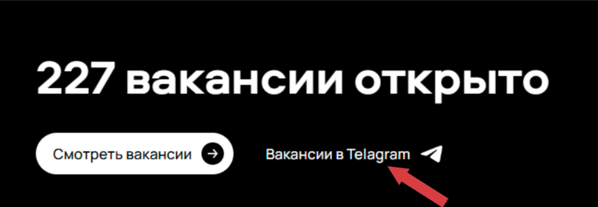                    |
| **Ожидаемое**              | Текст отображается как "Вакансии в Telegram".                                             |
| **Приоритет**              | Low                                                                                       |
| **Почему такой приоритет** | Никак не влияет на основной пользовательский сценарий, только визуальный баг.             |

---

### Баг-репорт #14

| Поле                       | Описание                                                                                                                                                                                                                                                                                                                          |
|----------------------------|-----------------------------------------------------------------------------------------------------------------------------------------------------------------------------------------------------------------------------------------------------------------------------------------------------------------------------------|
| **Заголовок**              | Нарушено выравнивание блоков вакансий                                                                                                                                                                                                                                                                                             |
| **Описание**               | В списке секций выдачи нарушено выравнивание элементов интерфейса: заголовки секций слева и кнопки "Про направление" справа отображаются с разными отступами.                                                                                                                                                                     |
| **Шаги воспроизведения**   | 1) Открыть страницу вакансий. 2) В строке поиска ввести запрос "Аналитик". 3) Применить фильтры: &nbsp;&nbsp;• Направление: Data Science &nbsp;&nbsp;• Город: Санкт-Петербург &nbsp;&nbsp;• Формат работы: Можно удаленно 4) Сравнить положение заголовков секций слева и кнопок справа между разными секциями. |
| **Фактический результат**  | Заголовки секций и кнопки "Про направление" расположены не по единой сетке: элементы "плавают" по горизонтали/вертикали, заметны разные отступы.                                                                                                                                                                                  |
| **Скриншот**               | 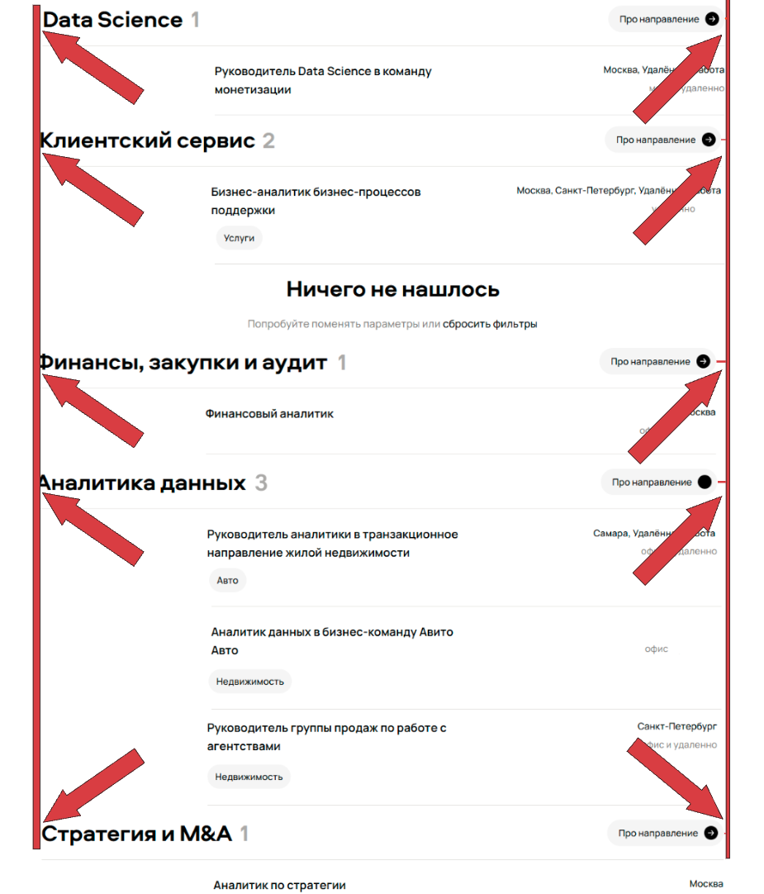                                                                                                                                                                                                                                                       |
| **Ожидаемое**              | Все секции отображаются по единой сетке: заголовки и кнопки выровнены одинаково, отступы консистентны.                                                                                                                                                                                                                            |
| **Приоритет**              | Medium                                                                                                                                                                                                                                                                                                                            |
| **Почему такой приоритет** | Никак не влияет на основной пользовательский сценарий, только визуальный баг.                                                                                                                                                                                                                                                     |

---

### Баг-репорт #15

| Поле                       | Описание                                                                                                                                                                                                                                                                                                                                                                                                        |
|----------------------------|-----------------------------------------------------------------------------------------------------------------------------------------------------------------------------------------------------------------------------------------------------------------------------------------------------------------------------------------------------------------------------------------------------------------|
| **Заголовок**              | Разные отступы между тегами                                                                                                                                                                                                                                                                                                                                                                                     |
| **Описание**               | В строке выбранных тегов под фильтрами отображаются неравномерные интервалы между элементами (между "Data Science" и "Поддержка пользователей" и "Аналитик").                                                                                                                                                                                                                                                   |
| **Шаги воспроизведения**   | 1) Открыть страницу вакансий. 2) В строке поиска ввести запрос "Аналитик". 3) Применить фильтры: &nbsp;&nbsp;• Направление: Data Science &nbsp;&nbsp;• Город: Санкт-Петербург &nbsp;&nbsp;• Формат работы: Можно удаленно 4) Убедиться, что под фильтрами отображаются теги "Data Science", "Поддержка пользователей", "Аналитик". 5) Сравнить визуально расстояния между тегами в строке. |
| **Фактический результат**  | Отступы между тегами отличаются.                                                                                                                                                                                                                                                                                                                                                                                |
| **Скриншот**               | 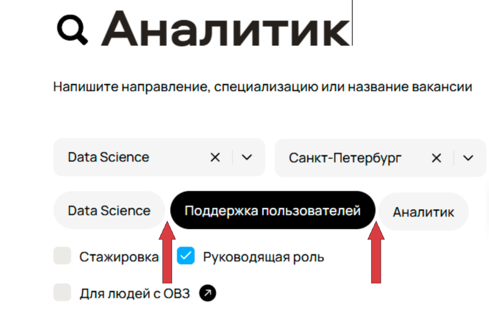                                                                                                                                                                                                                                                                                                                                                |
| **Ожидаемое**              | Отступы между тегами одинаковые.                                                                                                                                                                                                                                                                                                                                                                                |
| **Приоритет**              | Low                                                                                                                                                                                                                                                                                                                                                                                                             |
| **Почему такой приоритет** | Никак не влияет на основной пользовательский сценарий, только визуальный баг.                                                                                                                                                                                                                                                                                                                                   |

---

### Баг-репорт #16

| Поле                       | Описание                                                                                                                         |
|----------------------------|----------------------------------------------------------------------------------------------------------------------------------|
| **Заголовок**              | Фильтр "Команда" в строке выбора параметров отображается на разной высоте                                                        |
| **Описание**               | В верхнем блоке фильтров элементы "Город" и "Команда" расположены на разной высоте: один фильтр визуально "ниже/выше" соседнего. |
| **Шаги воспроизведения**   | 1) Открыть страницу вакансий. 2) Сравнить вертикальное положение фильтров "Город" и "Команда".                                |
| **Фактический результат**  | Соседние фильтры в одной строке расположены на разной высоте.                                                                    |
| **Скриншот**               | 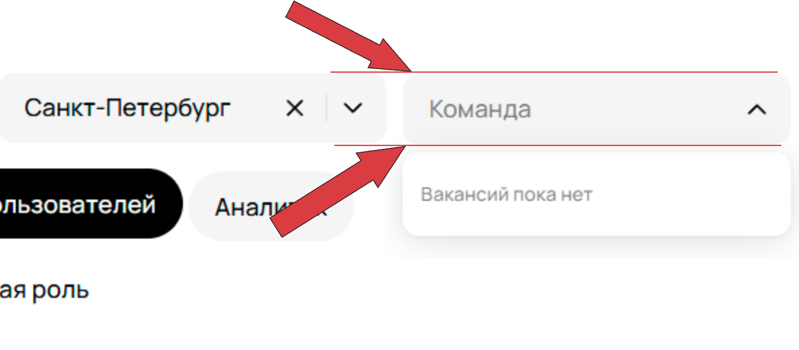                                                          |
| **Ожидаемое**              | Все фильтры выровнены по одной высоте.                                                                                           |
| **Приоритет**              | Low                                                                                                                              |
| **Почему такой приоритет** | Никак не влияет на основной пользовательский сценарий, только визуальный баг.                                                    |

---

### Баг-репорт #17

> **Спорный момент:** требуется свериться с макетом/ТЗ. Если формат работы по дизайну должен входить в строку локаций, то бага нет.

| Поле                       | Описание                                                                                                                                                                                                                                                                                                                                                                             |
|----------------------------|--------------------------------------------------------------------------------------------------------------------------------------------------------------------------------------------------------------------------------------------------------------------------------------------------------------------------------------------------------------------------------------|
| **Заголовок**              | Формат работы подставляется в строку локации (городов) в карточке вакансии                                                                                                                                                                                                                                                                                                           |
| **Описание**               | В правом верхнем блоке карточки вакансии (где перечисляются города, например "Москва, Санкт-Петербург") вместе с городами отображается формат работы. В строке городов должны отображаться только города.                                                                                                                                                                            |
| **Шаги воспроизведения**   | 1) Открыть страницу вакансий. 2) В строке поиска ввести запрос "Аналитик". 3) Применить фильтры: &nbsp;&nbsp;• Направление: Data Science &nbsp;&nbsp;• Город: Санкт-Петербург &nbsp;&nbsp;• Формат работы: Можно удаленно 4) Пролистать вниз до блока "Data Science". 5) Проверить строку локаций в вакансии "Руководитель Data Science в команду монетизации". |
| **Фактический результат**  | В строке городов отображается "Удаленная работа" (например: "Москва, Санкт-Петербург, Удаленная работа").                                                                                                                                                                                                                                                                            |
| **Скриншот**               | 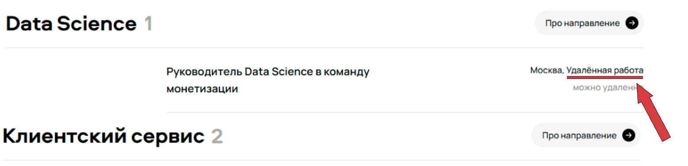                                                                                                                                                                                                                                                                                                                  |
| **Ожидаемое**              | В строке городов отображаются только города.                                                                                                                                                                                                                                                                                                                                         |
| **Приоритет**              | Low                                                                                                                                                                                                                                                                                                                                                                                  |
| **Почему такой приоритет** | Создаёт избыточность: формат работы дублируется, хотя он уже отображается ниже.                                                                                                                                                                                                                                                                                                      |
