# BUGS.md

Ниже перечислены найденные дефекты в API микросервиса объявлений (baseUrl: https://qa-internship.avito.com).
---

### Баг-репорт #1

| Поле                      | Описание                                                                                                                                                                                                            |
|---------------------------|---------------------------------------------------------------------------------------------------------------------------------------------------------------------------------------------------------------------|
| **Заголовок**             | POST `/api/1/item` возвращает только `status` вместо созданного объекта объявления                                                                                                                                  |
| **Описание**              | При успешном создании объявления ручка не возвращает объект объявления (id, sellerId, name, price, statistics, createdAt), а возвращает строковое поле `status` с UUID.                                             |
| **Шаги воспроизведения**  | 1) Отправить POST `https://qa-internship.avito.com/api/1/item`. 2) Тело запроса (валидное): `{"sellerID": 210800, "name": "Phone", "price": 1000, "statistics": {"likes": 1, "viewCount": 1, "contacts": 1}}` |
| **Фактический результат** | `200 OK`, тело: `{"status": "Сохранили объявление - <uuid>"}` (вернулся не объект объявления).                                                                                                                      |
| **Скриншот**              | 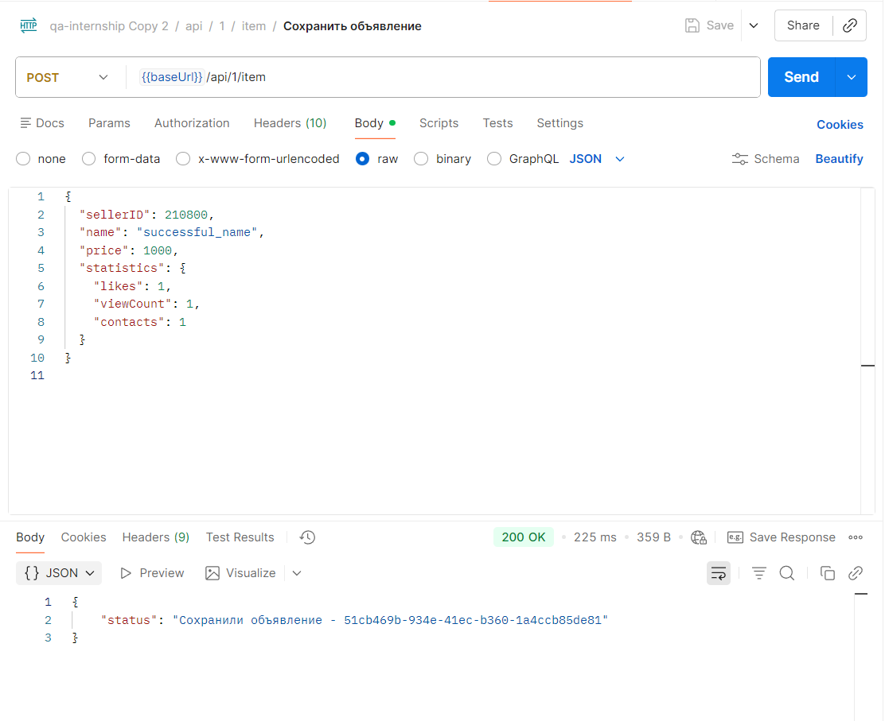                                                                                                                                                                            |                                                                                                                                                                           |
| **Ожидаемое**             | `200 OK`, тело - объект объявления с полями: `id`, `sellerId`, `name`, `price`, `statistics.likes`, `statistics.viewCount`, `statistics.contacts`, `createdAt`.                                                     |
| **Приоритет**             | High                                                                                                                                                                                                                |

---

### Баг-репорт #2

| Поле                      | Описание                                                                                                                         |
|---------------------------|----------------------------------------------------------------------------------------------------------------------------------|
| **Заголовок**             | Ошибка 400 для POST `/api/1/item` при отсутствии тела запроса возвращается в неверном формате                                    |
| **Описание**              | Для случая “запрос без body” возвращается `400`, но формат ошибки отличается от формата, описанного в Postman для `Bad Request`. |
| **Шаги воспроизведения**  | 1) Отправить POST `https://qa-internship.avito.com/api/1/item` без тела запроса.                                                 |
| **Фактический результат** | `400 Bad Request`, тело: `{"code": 400, "message": "invalid content type"}`.                                                     |
| **Скриншот**              | 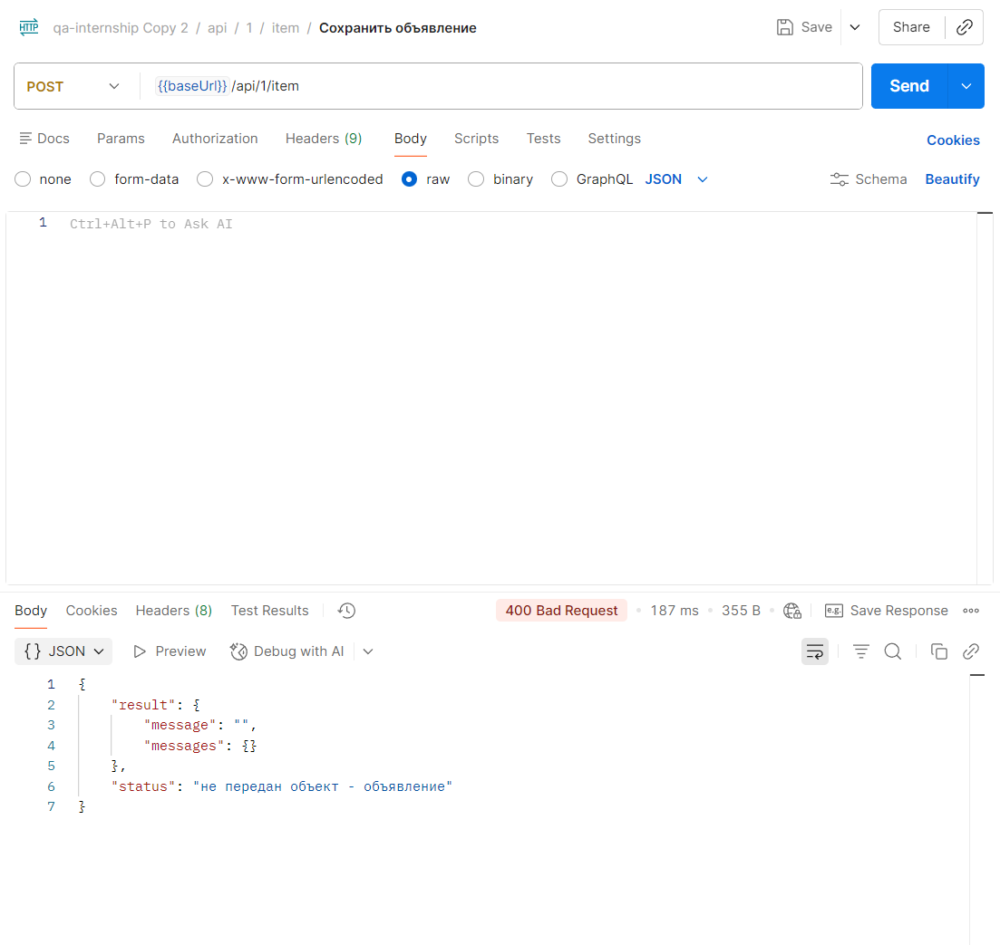                                                                                         |                                                                                        |
| **Ожидаемое**             | `400 Bad Request` в формате из Postman: `{"result": {"messages": {...}, "message": "<string>"}, "status": "<string>"}`.          |
| **Приоритет**             | High                                                                                                                             |

---

### Баг-репорт #3

| Поле                      | Описание                                                                                                                                                                                                                                                                                                                                                                                                                                                                                            |
|---------------------------|-----------------------------------------------------------------------------------------------------------------------------------------------------------------------------------------------------------------------------------------------------------------------------------------------------------------------------------------------------------------------------------------------------------------------------------------------------------------------------------------------------|
| **Заголовок**             | POST `/api/1/item` принимает отрицательные значения в полях, которые должны быть неотрицательными                                                                                                                                                                                                                                                                                                                                                                                                   |
| **Описание**              | Сервис сохраняет объявление с отрицательными значениями, где ожидается валидация (`sellerID < 0`, `price < 0`, отрицательные значения в статистике).                                                                                                                                                                                                                                                                                                                                                |
| **Шаги воспроизведения**  | 1) Отправить POST `https://qa-internship.avito.com/api/1/item`. 2) Передать одно из значений отрицательным, например: `{"sellerID": -1, "name": "Phone", "price": 1000, "statistics": {"likes": 1, "viewCount": 1, "contacts": 1}}` или `{"sellerID": 210800, "name": "Phone", "price": -1000, "statistics": {"likes": 1, "viewCount": 1, "contacts": 1}}` или `{"sellerID": 210800, "name": "Phone", "price": 1000, "statistics": {"likes": -1, "viewCount": 1, "contacts": 1}}` |
| **Фактический результат** | Возвращается `200 OK` и объявление сохраняется.                                                                                                                                                                                                                                                                                                                                                                                                                                                     |
| **Скриншот**              | 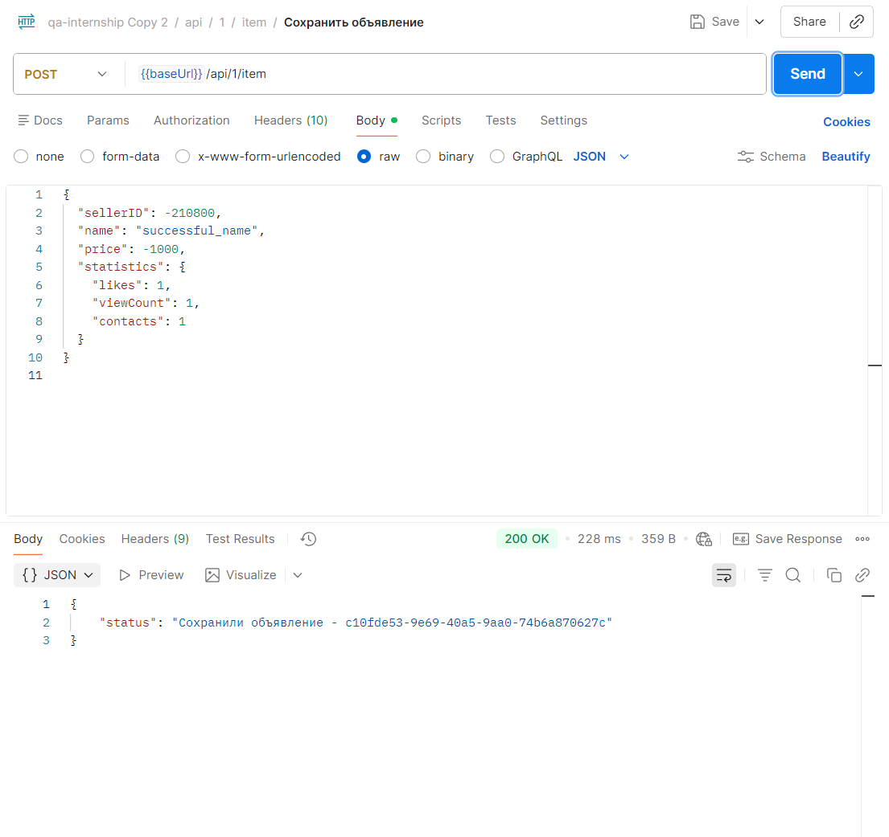                                                                                                                                                                                                                                                                                                                                                                                                                                                            |
| **Ожидаемое**             | `400 Bad Request` (ошибка валидации), объявление не должно сохраняться.                                                                                                                                                                                                                                                                                                                                                                                                                             |
| **Приоритет**             | High                                                                                                                                                                                                                                                                                                                                                                                                                                                                                                |

---

### Баг-репорт #4

| Поле                      | Описание                                                                                                                       |
|---------------------------|--------------------------------------------------------------------------------------------------------------------------------|
| **Заголовок**             | При запросе GET `/api/1/{sellerID}/item` символ `#` в path приходит неконсистентный ответ: 404 + `code: 400`                   |
| **Описание**              | При запросе, где в path-параметре sellerID присутствует символ #, сервер отвечает `404 Not Found`, но тело содержит code: 400. |
| **Шаги воспроизведения**  | 1) Отправить GET `https://qa-internship.avito.com/api/1/#/item`.  2) Обратить внимание на HTTP статус и тело ответа.        |
| **Фактический результат** | `404 Not Found`, тело (пример): `{"message": "route /api/1/ not found", "code": 400}`.                                         |
| **Скриншот**              | 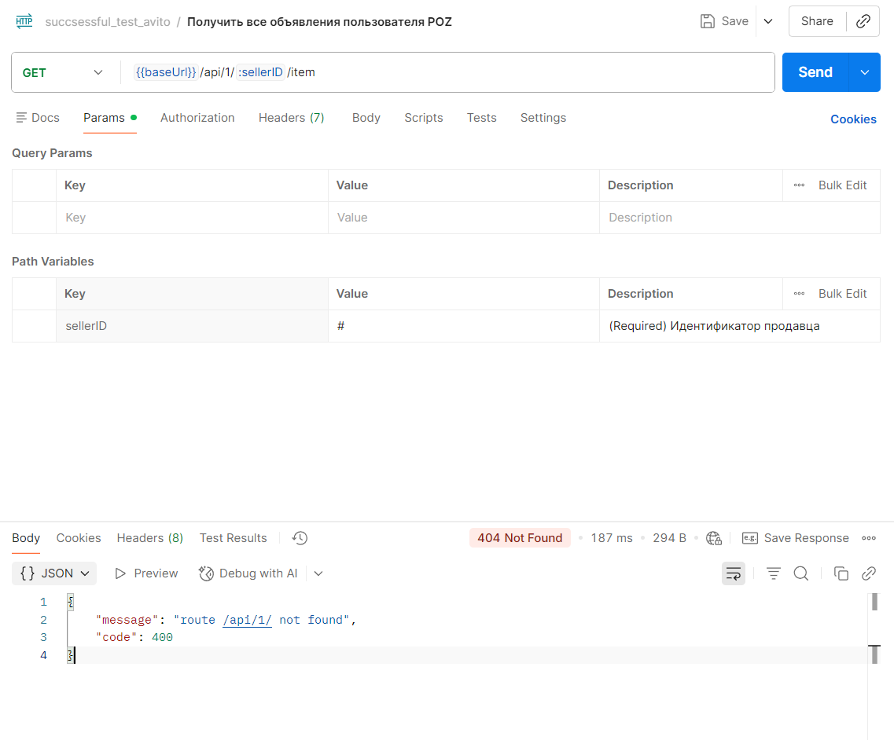                                                                                       |
| **Ожидаемое**             | Консистентность: при `404` в HTTP-статусе поле `status` в теле должно быть `"404"`.                                            |
| **Приоритет**             | Medium                                                                                                                         |

---

### Баг-репорт #5

| Поле                      | Описание                                                                                                                                                                                                                                                                                         |
|---------------------------|--------------------------------------------------------------------------------------------------------------------------------------------------------------------------------------------------------------------------------------------------------------------------------------------------|
| **Заголовок**             | Для 404 Not Found фактический формат ошибки не совпадает с Postman коллекцией                                                                                                                                                                                                                    |
| **Описание**              | По Postman `404` описан как `{"result": "<string>", "status": "<string>"}`, но на стенде часто приходит `{"result": {"message": "...", "messages": null}, "status": "404"}` - то есть `result` объект, а не строка.                                                                              |
| **Шаги воспроизведения**  | 1) Отправить запрос, который гарантированно приводит к `404`, например:  - GET {{baseUrl}}/api/1/statistic/<random_uuid> (uuid не существует).  - GET {{baseUrl}}/api/1/item/<random_uuid> (uuid не существует).  - GET {{baseUrl}}/api/2/statistic/<random_uuid> (uuid не существует). |
| **Фактический результат** | `404 Not Found`, тело (пример): `{"result": {"message": "… not found", "messages": null}, "status": "404"}`.                                                                                                                                                                                     |
| **Скриншот**              | 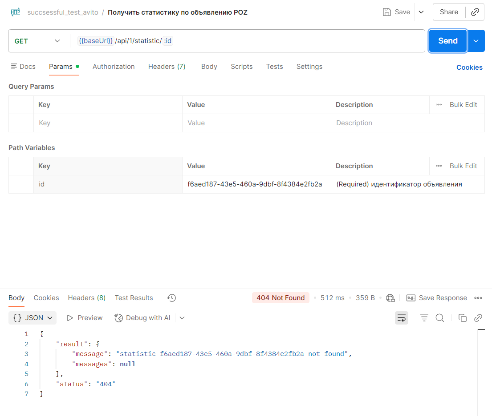                                                                                                                                                                                                                                                         |
| **Ожидаемое**             | Формат 404 соответствует описанию в Postman-коллекции, либо коллекция должна быть обновлена под фактический контракт.                                                                                                                                                                            |
| **Приоритет**             | Medium                                                                                                                                                                                                                                                                                           |

---

### Баг-репорт #6

| Поле                      | Описание                                                                                                                                                        |
|---------------------------|-----------------------------------------------------------------------------------------------------------------------------------------------------------------|
| **Заголовок**             | V2: при удалении несуществующего объявления HTTP-статус 404, но в теле `status` бывает `500`                                                                    |
| **Описание**              | Для кейса “удаление по валидному UUID, которого нет в системе” сервер возвращает `404`, однако поле `status` внутри тела ответа регулярно приходит как `"500"`. |
| **Шаги воспроизведения**  | 1) Отправить DELETE `https://qa-internship.avito.com/api/2/item/<random_uuid>` (uuid, которого точно нет).                                                      |
| **Фактический результат** | `404 Not Found`, тело (пример): `{"result": {"message": "", "messages": null}, "status": "500"}` или другой вариант с `status="500"`.                           |
| **Скриншот**              | 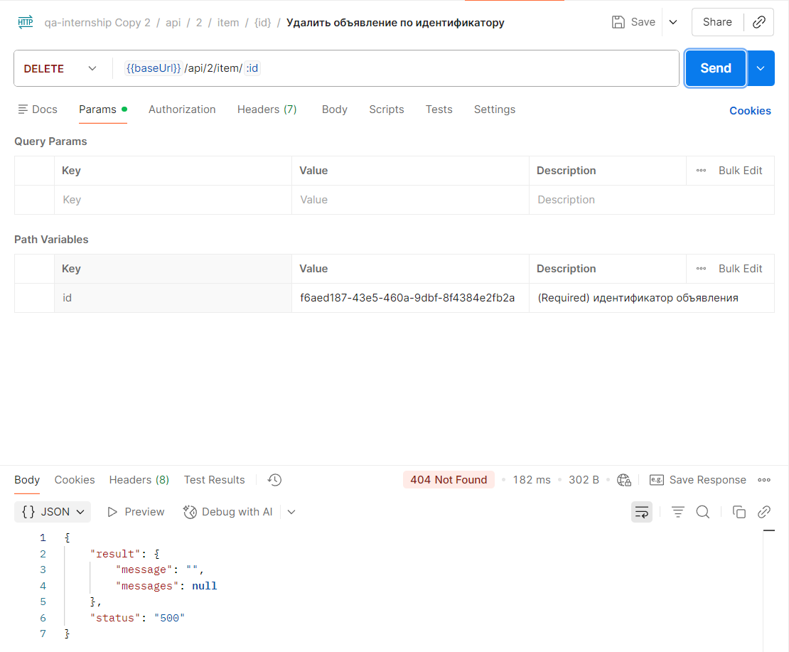                                                                                                                        |
| **Ожидаемое**             | Консистентность: при `404` в HTTP-статусе поле `status` в теле должно быть `"404"` (или отсутствовать), а не `"500"`.                                           |
| **Приоритет**             | Medium                                                                                                                                                          |

---

### Баг-репорт #7

| Поле                      | Описание                                                                                                                                                                                                                 |
|---------------------------|--------------------------------------------------------------------------------------------------------------------------------------------------------------------------------------------------------------------------|
| **Заголовок**             | POST `/api/1/item`: поля `statistics.likes/viewCount/contacts` не принимают значение `0`                                                                                                                                 |
| **Описание**              | При создании объявления значения `0` в полях статистики не принимаются, хотя по смыслу счётчики должны поддерживать `0` (например, у нового объявления).                                                                 |
| **Шаги воспроизведения**  | 1) Отправить POST `https://qa-internship.avito.com/api/1/item`. 2) Тело запроса (пример): `{"sellerID": 210800, "name": "successful_name", "price": 1, "statistics": {"likes": 0, "viewCount": 0, "contacts": 0}}` |
| **Фактический результат** | Возвращается ошибка (400) с сообщением про обязательность/некорректность поля (варианты ответа варируются исходя из поля).                                                                                               |
| **Скриншот**              | 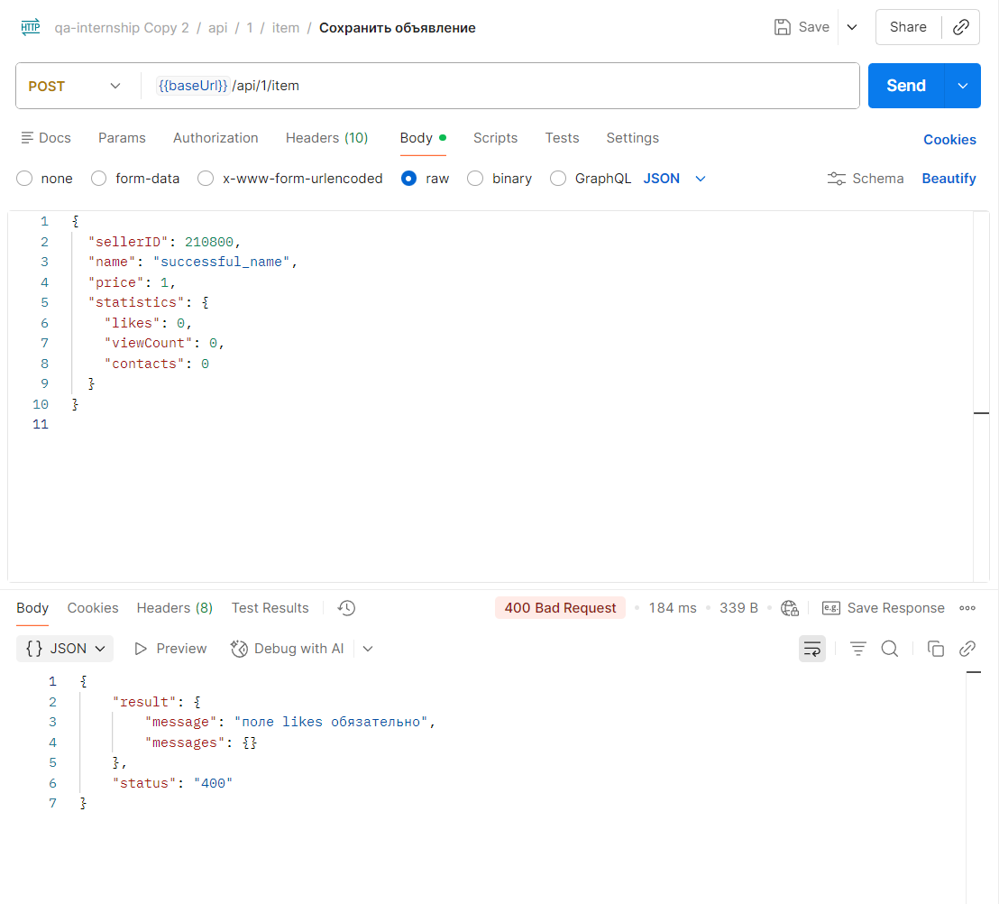                                                                                                                                                                                 |
| **Ожидаемое**             | `200 OK`, объявление создаётся; значения статистики `0` допустимы для нового объявления.                                                                                                                                 |
| **Приоритет**             | Medium                                                                                                                                                                                                                   |

---

### Баг-репорт #8

| Поле                      | Описание                                                                                                                                                                                                                                                          |
|---------------------------|-------------------------------------------------------------------------------------------------------------------------------------------------------------------------------------------------------------------------------------------------------------------|
| **Заголовок**             | POST `/api/1/item`: значение `price = 0` не принимается                                                                                                                                                                                                           |
| **Описание**              | При создании объявления значение `price = 0` приводит к ошибке. Если по требованиям цена может быть нулевой (например, бесплатное объявление), это дефект валидации. Если цена должна быть строго > 0, то в ответе должна возвращаться понятная ошибка валидации. |
| **Шаги воспроизведения**  | 1) Отправить POST `https://qa-internship.avito.com/api/1/item`. 2) Тело запроса (пример): `{"sellerID": 210800, "name": "Phone", "price": 0, "statistics": {"likes": 1, "viewCount": 1, "contacts": 1}}`                                                    |
| **Фактический результат** | Возвращается ошибка (400) / объявление не создаётся.                                                                                                                                                                                                              |
| **Скриншот**              | 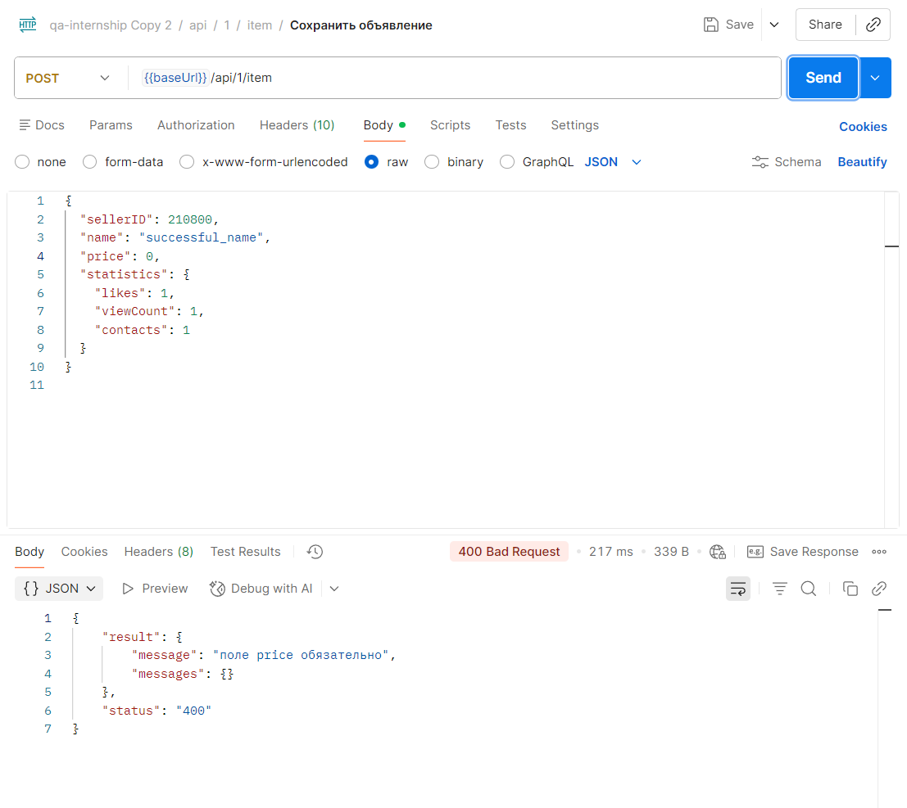                                                                                                                                                                                                                          |
| **Ожидаемое**             | В зависимости от требований: либо `200 OK` (если `0` допустим), либо `400 Bad Request` с явным сообщением “price должен быть > 0” в контрактном формате ошибки.                                                                                                   |
| **Приоритет**             | Low                                                                                                                                                                                                                                                               |

---

### Баг-репорт #9

| Поле                      | Описание                                                                                                                                                       |
|---------------------------|----------------------------------------------------------------------------------------------------------------------------------------------------------------|
| **Заголовок**             | POST `/api/1/item`: при некорректном `sellerID` возвращается нерелевантный текст ошибки                                                                        |
| **Описание**              | Для кейса “некорректный sellerID” сервис возвращает сообщение в поле `status`, вместо статуса ошибки.                                                          |
| **Шаги воспроизведения**  | 1) Отправить POST `https://qa-internship.avito.com/api/1/item`, передав некорректный `sellerID` (например `"sellerID": "qwerty"`, все остальные поля валидные. |
| **Фактический результат** | `400 Bad Request`, тело (пример): `{"result": {"message": "", "messages": {}}, "status": "не передано тело объявления"}`                                    |
| **Скриншот**              |                                                                                                                        |
| **Ожидаемое**             | `400 Bad Request` с сообщением по сути ошибки в контрактном формате.                                                                                           |
| **Приоритет**             | Medium                                                                                                                                                         |

---

### Баг-репорт #10

| Поле                      | Описание                                                                                                                            |
|---------------------------|-------------------------------------------------------------------------------------------------------------------------------------|
| **Заголовок**             | Несогласованность нейминга поля `sellerID` в запросе и `sellerId` в ответе (контракте)                                              |
| **Описание**              | В запросе на создание используется поле `sellerID` (ID заглавными), а в ожидаемых ответах и других ручках - `sellerId` (camelCase). |
| **Шаги воспроизведения**  | 1) Сравнить body запроса на создание (`sellerID`) и ожидаемые ответы из Postman (`sellerId`).                                       |
| **Фактический результат** | Разные варианты именования одного поля.                                                                                             |
| **Скриншот**              | 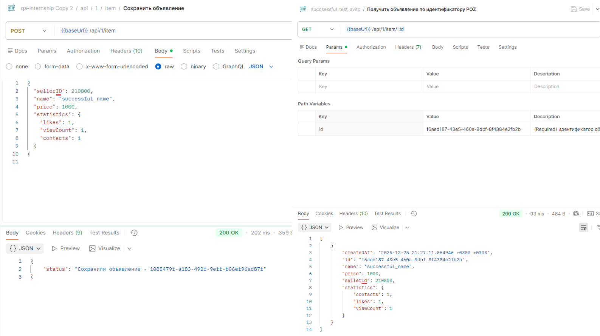                                                                                          |
| **Ожидаемое**             | Единый стиль нейминга: либо везде `sellerId`, либо везде `sellerID`.                                                                |
| **Приоритет**             | Low                                                                                                                                 |

---

### Баг-репорт #11

| Поле                      | Описание                                                                                                                                                                                              |
|---------------------------|-------------------------------------------------------------------------------------------------------------------------------------------------------------------------------------------------------|
| **Заголовок**             | GET /api/2/statistic/{itemId}: HTTP 404, но в теле ошибки status='400' (неконсистентный контракт)                                                                                                     |
| **Эндпоинт**              | `GET /api/2/statistic/{itemId}`                                                                                                                                                                       |
| **Описание**              | При запросе статистики по несуществующему/некорректному id сервер возвращает HTTP `404`, но в JSON-теле указывает `status: "400"`. В итоге HTTP-код и поле `status` в ответе противоречат друг другу. |
| **Предусловия**           | Нет                                                                                                                                                                                                   |
| **Шаги воспроизведения**  | 1) Отправить `GET /api/2/statistic/invalidId`  2) (или) `GET /api/2/statistic/` + очень длинная строка (например 700 символов)                                                                        |
| **Фактический результат** | HTTP `404`, но тело вида: `{ "result": { "message": "передан некорректный идентификатор объявления", "messages": null }, "status": "400" }`                                                           |
| **Скриншот**              | 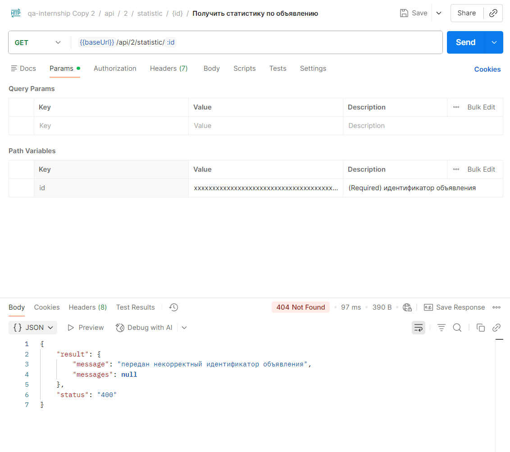                                                                                                                                                            |
| **Ожидаемое**             | Либо: HTTP `400` (если id некорректный) и тело с `status: "400"`. Либо: HTTP `404` (если id валиден, но не найден) и тело с `status: "404"`.                                                          |
| **Приоритет**             | Medium                                                                                                                                                                                                |
| **Связанные тест-кейсы**  | `TC-056`, `TC-057`                                                                                                                                                                                    |

---

### Баг-репорт #12

| Поле                      | Описание                                                                                                                                                                                                                                      |
|---------------------------|-----------------------------------------------------------------------------------------------------------------------------------------------------------------------------------------------------------------------------------------------|
| **Заголовок**             | POST /api/1/item: при ошибках валидации (неверный тип полей) возвращается status=текст и пустой message                                                                                                                                       |
| **Эндпоинт**              | `POST /api/1/item`                                                                                                                                                                                                                            |
| **Описание**              | Для ряда ошибок валидации (когда поле передано с неверным типом) сервер возвращает HTTP `400`, однако в теле ответа поле `status` содержит текст (`"не передано тело объявления"`), а `result.message` - пустая строка.                       |
| **Предусловия**           | Нет                                                                                                                                                                                                                                           |
| **Шаги воспроизведения**  | Отправить `POST /api/1/item` с валидным телом, но заменить одно поле на неверный тип, например: `name=123`, `price="1000"`, `price=1000.5`, `statistics="bad"`, `statistics=[]`, `statistics.likes="1"` (аналогично `viewCount`, `contacts`). |
| **Фактический результат** | HTTP `400`, тело вида: `{ "result": { "message": "", "messages": {} }, "status": "не передано тело объявления" }`                                                                                                                             |
| **Скриншот**              | 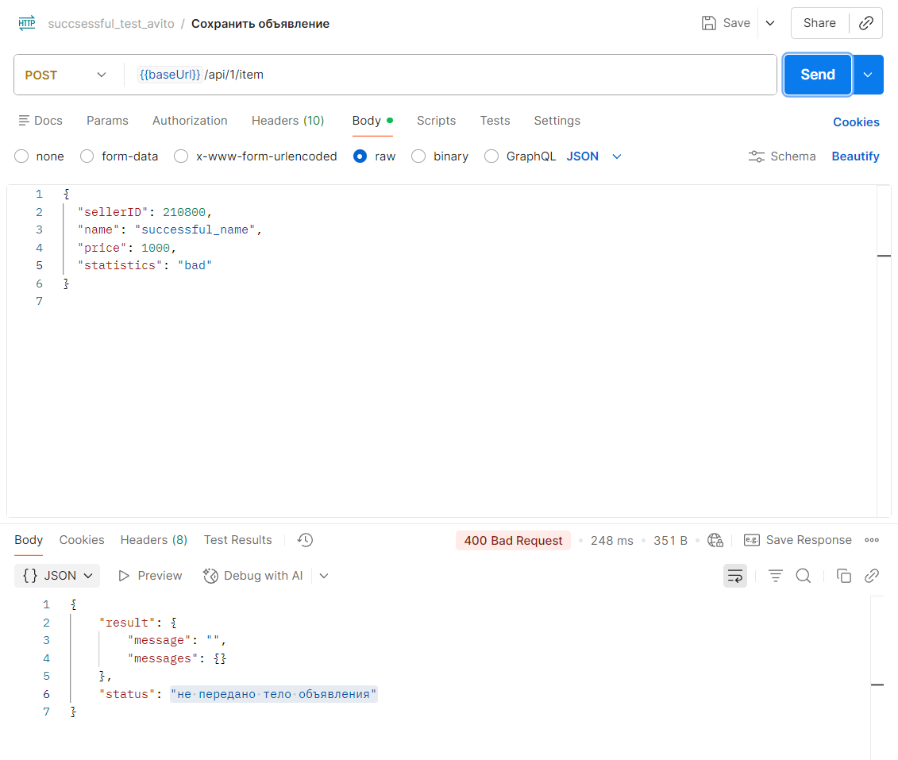                                                                                                                                                                                                    |
| **Ожидаемое**             | HTTP `400` и тело ошибки, где `status: "400"`, а `result.message` содержит понятное сообщение о конкретном невалидном поле/типе.                                                                                                              |
| **Приоритет**             | Medium                                                                                                                                                                                                                                        |
| **Связанные тест-кейсы**  | `TC-016`, `TC-019`, `TC-022`, `TC-024`, `TC-025`, `TC-029`, `TC-030`, `TC-031`                                                                                                                                                                |

